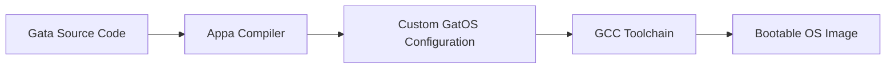

<p align="center">
  
</p>

<h1 align="center">The Gata Compiler: Turning a Program Into an Operating System</h1>

<p align="center">
  <a href="https://github.com/ApparentlyPlus/Appa/actions/workflows/linux.yml"></a>
  <a href="https://github.com/ApparentlyPlus/Appa/actions/workflows/windows.yml"></a>
  <a href="https://github.com/ApparentlyPlus/Appa/actions/workflows/macos-arm.yml"></a>
  <a href="https://github.com/ApparentlyPlus/Appa/actions/workflows/macos-intel.yml"></a>
  <a href="#license"></a>
  
  
</p>

Appa is the compiler for [the Gata programming language](https://github.com/ApparentlyPlus/Gata). It takes Gata source, transpiles it to C, and drives a bundled cross-toolchain that compiles that C together with a custom-configured [GatOS](https://github.com/ApparentlyPlus/GatOS) kernel into a bootable ISO. It is also part of my undergraduate thesis at the [University of Macedonia](https://www.uom.gr/en/dai), and is the piece that ties the PawStack toolchain together.

The interesting part is not that it emits C. It's that it *reads your program to decide what kind of operating system you need*. Write a program that never allocates, and the heap doesn't get built. Never spawn a thread, and the scheduler doesn't ship. [What's Inside the Compiler](#whats-inside-the-compiler) has the full house tour.

And getting from nothing to a booting OS really is three commands. Check [Getting Started](#getting-started) if you want to run it without reading the rest.

> [!NOTE]
> This is a student project, written solo as an undergraduate thesis, so expect the occasional rough edge and the odd bug. That said, the compiler has a real frontend, a real IR and a real backend, and it is tested rather harder than most things I have written.

The first section of this README focuses on providing some insight as to the vision of this project. If you'd rather skip the philosophy, the technical part starts at [What's Inside the Compiler](#whats-inside-the-compiler).

## Table of Contents

- [Project Overview & Background](#project-overview--background)
- [What's Inside the Compiler](#whats-inside-the-compiler)
- [What's *not* Inside the Compiler](#whats-not-inside-the-compiler)
- [Getting Started](#getting-started)
- [Configuring a Project](#configuring-a-project)
- [CLI Reference](#cli-reference)
- [Testing](#testing)
- [Development](#development)
- [Documentation](#documentation)
- [Contributing](#contributing)
- [License](#license)
- [Acknowledgments](#acknowledgments)
- [So... what now?](#so-what-now)


## Project Overview & Background

### What is PawStack?

"PawStack" is just the name I decided to use for a development toolchain that aims to drastically simplify OS development. It allows you to write code just like you would for a regular program — but instead of compiling to an application, your code is compiled directly into a complete, bootable operating system image.

This means your program ***is*** the operating system.

PawStack handles the complex parts of turning your code into low-level machine instructions that run on real hardware or emulators. The goal is to let you focus on building your OS's features without worrying about the usual technical challenges involved in OS development.

The whole toolchain is comprised of 3 components:

| Component | Description | Status |
|-----------|-------------|--------|
| **[GatOS](https://github.com/ApparentlyPlus/GatOS)** | A modular kernel forming the core of PawStack, exposing APIs and syscalls for core OS functionality. | **Feature Complete** |
| **[Gata](https://github.com/ApparentlyPlus/Gata)** | A custom high-level programming language for writing operating systems. It *feels* like a modern language, but is built with features that make low-level development simpler and more approachable. | **Usable, Stabilizing** |
| **Appa** | The current project. The compiler for Gata. It takes in Gata source code and transpiles it into C code that calls GatOS's APIs, constructing the kernel based on the code's logic by leveraging the modularity of GatOS's design. | **Usable** |

> [!TIP]
> Appa ships everything it needs. `appa install` pulls down the bundled GCC cross-toolchain, GRUB, QEMU, xorriso and mtools, plus the GatOS template and the [`libgata`](https://github.com/ApparentlyPlus/Gata/tree/main/libgata) standard library. There is no separate "set up your cross compiler" afternoon.

### Build Pipeline



Appa is the `B` and the arrow into `D`. It owns everything from the first token to handing GRUB a kernel binary.

> [!WARNING]
> Appa does not produce a standalone executable for the GatOS target. The output is an ISO — the program and the kernel are the same artifact. If you want a normal binary, that is what the `Hosted` backend is for.

### What's with these names?

Glad you asked! Here's the story behind them:

**GatOS** is a playful pun on the Greek word *gatos* (meaning "male cat"), with the "OS" tacked on for "Operating System". It was inspired by a similar, more educationally focused project called [Skyl-OS](https://github.com/Billyzeim/Skyl-OS) — another pun, this time on *skylos* (meaning "male dog") — created by a close friend of mine.

Following the same "cat" theme, I named the high-level language of the toolchain "**Gata**" — Greek for "female cat." It felt like the perfect fit for the language developers will use to interact with the toolchain, write code, and build their projects.

Finally, the compiler in the toolchain is called **Appa**. The name is inspired from the flying bison in Nickelodeon's animated series *"Avatar: The Last Airbender"*, a loyal companion to the main cast. The "bison" part is intentional — it's a direct nod to [GNU Bison](https://github.com/akimd/bison), the well-known syntax analysis tool used in building compilers.

"**PawStack**" is just a blend of comp-sci lingo and the animal based naming convention — perfect name for describing the entire toolchain ;)

### What is your university thesis on?

In short, my thesis focuses on developing a functional demo of the PawStack toolchain and thoroughly documenting its inner workings.

When I began, I had zero prior experience in OS development. Because of that, I see this as a great opportunity not only to deliver the demo, but also to create concise write-ups detailing my journey — what steps I took, the mistakes I made, what I omitted, what could be improved, and the features I implemented.

The end goal is for this to serve as a helpful reference in a field where accessible, beginner-friendly resources are scarce.

### Are you crazy?

Yes, and by this point it's documented. Writing a kernel was the ambitious part. Writing a *language* for the kernel was the stubborn part. Writing the compiler that connects them, with its own type system, ARC insertion and dead-code elimination, was the part where I stopped being able to explain the project at parties.

Update: it works. You can write ten lines of Gata and get an ISO that boots on real hardware, and the compiler will have quietly decided you didn't need a scheduler.


## What's Inside the Compiler

Appa is roughly **23,000 lines of C#** across 43 files, published as a **self-contained, ahead-of-time-compiled** native binary — so there is no .NET runtime to install and startup is instant.

It is a real compiler, not a preprocessor. Source goes through a full frontend into a typed IR, gets lowered and optimized, and only then becomes C.

### Pass Order

```
Lexer -> Parser -> ScopeBinder -> Monomorphizer -> SymbolCollector -> TypeResolver
      -> Desugar -> CapabilityScan -> DCE -> Densifier -> Ownership -> Emitter -> C -> gcc
```

The frontend re-runs for up to **6 rounds**, because resolving a generic call can discover a new instantiation that itself needs resolving. It settles, and then it stops.

| Stage | What it does |
|---|---|
| **Lexer / Parser** | Hand-written, producing a full syntax tree with source spans preserved for diagnostics. |
| **ScopeBinder** | Realm and process scopes, `@shadows`, qualifiers. Names in Gata are global by design, so this is where that gets enforced. |
| **Monomorphizer** | Stamps out concrete versions of generic classes and unions. Gata has no runtime generics — `List[int]` and `List[String]` are two distinct types by the time the backend sees them. |
| **SymbolCollector** | The declaration registry, plus binding for `@intrinsic` and `@builtin`. |
| **TypeResolver** | Types, overload resolution, and every semantic diagnostic. This is the largest single piece of the compiler and it is where most of the errors you'll ever see come from. |
| **Desugar** | String interpolation, `switch`, `match`. |
| **CapabilityScan** | Walks the reachable call graph from every entry point to work out what the OS actually has to provide. See below — this is the interesting one. |
| **DCE** | Drops everything the entry points can't reach. You import `List` and use one method; you pay for one method. |
| **Densifier** | Rewrites readable names to dense ones. `--emit-sourcemap` writes a `sourcemap.json` so you can map them back. |
| **Ownership** | Inserts ARC retain/release, and lowers `throws` and `defer`. |
| **Emitter** | C99-ish output, into `program.c` and `shared.h`. |

### Capability Inference

This is the part that makes PawStack more than "a transpiler with a kernel attached."

`CapabilityScan` walks the reachable code from your entry points and infers which OS subsystems the program genuinely needs. Those become `-D` macros, and GatOS `#ifdef`s out everything else. A program that never allocates does not get a heap. A program with no processes does not get a scheduler, a TTY stack or a dashboard.

| Capability | Inferred when |
|---|---|
| `GATA_CAP_MEM` | The program allocates — collections, strings, anything through the heap. |
| `GATA_CAP_THREADS` | Any process or thread is declared, kernel or user. |
| `GATA_CAP_INPUT` | The program reads input, or `THREADS` is on. |
| `GATA_CAP_TIME` | The program reads the clock. |
| `GATA_CAP_FRAMEBUFFER` / `GATA_OUTPUT_SERIAL` | From the manifest's `OutputType`, not inferred. |
| `GATA_KBD_DEFAULT` / `_EXTERNAL` / `_HOTPLUG` | From the manifest's `KeyboardSupport`. |

The capabilities imply one another rather than sitting independently: threads pull in the heap and the input path, USB keyboards pull in the heap, and anything needing an IRQ pulls in ACPI/APIC. Those rules live in three places that must agree — `ResolveCaps` here, `src/kernel/caps.h` in GatOS, and GatOS's `run.py` — and there is a CI matrix specifically to keep them honest.

The practical effect, measured on a real build: a minimal serial program produces a kernel around **66 KB**, where a full-featured framebuffer one is around **218 KB**. You only ship the OS you asked for.

### Diagnostics

**102 diagnostic codes** (`G000`–`G101`), each with a stable identifier so they can be looked up rather than guessed at:

```
main.g:3:9: error[G007]: unknown type 'long'
```

`--werror` promotes warnings, and `appa check` runs the frontend alone — parse, resolve, diagnose, emit nothing — which is what you want in an editor loop or a pre-commit hook.

### Backends

| Backend | Output |
|---|---|
| **GatOS** | The full path. Emits C, stages the GatOS template, compiles both with the bundled cross-GCC, links against the linker script, and packages an ISO with GRUB. |
| **Hosted** | Emits `program.c` and `shared.h` and stops. Compile it with any normal C compiler and run it as an ordinary program. Invaluable for testing language semantics without booting anything. |

### The Bundled Toolchain

`appa install` fetches and installs a complete, statically built cross-toolchain, so nothing on your host is required beyond appa itself:

* **GCC + Binutils** — the `x86_64-elf` cross compiler
* **GRUB** + **xorriso** + **mtools** — for producing the hybrid bootable ISO
* **QEMU** — so `appa run` just works
* **The GatOS template** and **libgata** — the kernel sources and the standard library

`appa update` refreshes all of it and self-updates the appa binary in place.


## What's *not* Inside the Compiler

Same deal as GatOS: better you hear it from me now than discover it three hours in.

| Not here | Why not |
|---|---|
| **An optimizer** | Appa does DCE and monomorphization, then hands C to GCC and lets it do what it is extremely good at. Writing a second-rate optimizer in front of a first-rate one is a losing trade. |
| **Incremental compilation** | The whole program is compiled every time. It takes well under a second for a realistic project, so there has been no reason to build a cache and a dependency graph to invalidate it. |
| **A language server** | There is a VS Code extension in the [Gata repo](https://github.com/ApparentlyPlus/Gata) for syntax highlighting, but no LSP. `appa check` is fast enough to hook into a save action, which covers most of the value. |
| **Separate compilation / linking Gata to Gata** | Gata programs are whole-program compiled. This is what makes DCE and capability inference possible in the first place — you cannot drop the scheduler if some other translation unit might still want it. |
| **Targets other than x86_64** | One architecture, done properly. GatOS is x86_64 only, so there is nothing else to lower to. |


## Getting Started

If you have nothing installed, this is the whole thing:

```bash
# 1. Install appa, the toolchain, the template and the stdlib
appa install

# 2. Scaffold a project
appa new myos && cd myos

# 3. Build it and boot it in QEMU
appa run
```

That's it! You now have an operating system.

`appa new` gives you three files:

```
myos/
├── myos.gconf     Project configuration
├── env.g          The environment (bindings between Gata and GatOS)
└── src/main.g     Your program
```

And `src/main.g` starts life looking like this:

```gata
import Console;

realm kernel {
    entry func Main() {
        Console.PrintLine("Hello from the kernel!");
    }
}
```

> [!IMPORTANT]
> `env.g` is the binding layer between Gata and the kernel's C API. It is scaffolded for you and you almost certainly should not edit it. The one exception is if you are extending GatOS itself and need to expose a new call.

> [!TIP]
> The `Hosted` backend is the fastest way to iterate on program logic. Set `<TargetBackend>Hosted</TargetBackend>`, run `appa build`, and compile `transpilation/program.c` with your system compiler — no emulator, no boot, just your program.


## Configuring a Project

Every project is described by exactly one `<name>.gconf` file in its root:

```xml
<appa>
    <ProjectName>myos</ProjectName>
    <TargetBackend>GatOS</TargetBackend>
    <BuildMode>Debug</BuildMode>
    <OutputType>Framebuffer</OutputType>
    <KeyboardSupport>Default</KeyboardSupport>
    <CapabilityDiscovery>On</CapabilityDiscovery>
</appa>
```

| Field | Values | Meaning |
|---|---|---|
| `ProjectName` | any | Names the output artifacts. |
| `TargetBackend` | `GatOS` \| `Hosted` | Bootable ISO, or plain C for a normal machine. |
| `BuildMode` | `Debug` \| `Release` | Optimization level for the emitted C. |
| `OutputType` | `Framebuffer` \| `Serial` | Where output goes. `Serial` builds no framebuffer console at all — output, screen control and even the panic report go to COM1. |
| `KeyboardSupport` | `Default` \| `External` \| `Hotplug` | PS/2 only, plus USB HID, or plus USB hotplug detection. |
| `CapabilityDiscovery` | `On` \| `Off` | `On` infers capabilities from your program. `Off` assumes all of them — the escape valve for when inference has a blind spot. |

GCC flags, the entry file and the environment file are deliberately *not* configurable here. Appa owns those.


## CLI Reference

**Commands:**

| Command | Description |
| --- | --- |
| `appa install` | Install the toolchain, template, libgata and envs. |
| `appa update` | Re-download the bundle and self-update the appa binary. |
| `appa new <name>` | Scaffold a project. |
| `appa check [project]` | Frontend only — parse, resolve, diagnose. Emits nothing. |
| `appa build [project]` | Build the project into an ISO. |
| `appa run [project]` | Build, then launch in QEMU. |
| `appa clean [project]` | Remove `transpilation/`, `build/`, `artifacts/`. |
| `appa --version` | Print the version. |

A project argument is a directory or a path to its `.gconf`; the default is the current directory.

**Install options:**

| Option | Description |
| --- | --- |
| `--with-path` | Add appa to `PATH` without asking (re-runs elevated if needed). |
| `--no-path` | Install without touching `PATH`. |
| `--force` | Overwrite an existing install without confirming. |

**Build options** (also accepted by `run` and `check`):

| Option | Description |
| --- | --- |
| `--stdlib <dir>` | Override the libgata directory. |
| `--werror` | Treat warnings as errors. |
| `--env <env.g>` | Environment file, overriding discovery. |
| `--entry <file.g>` | Entry source, overriding discovery. |
| `--emit-sourcemap` | Write `sourcemap.json` mapping dense names back to readable ones. |
| `--pure-transpile` | Emit C and stop, with no `.gconf` at all. Needs `--env` and `--entry`. |

**Run options:**

| Option | Description |
| --- | --- |
| `headless` | No QEMU window — serial only. |
| `timeout=<Xs>` | Kill the guest after a duration (`30s`, `5m`, `1h`). |

Examples:

```bash
# The happy path
appa new myos && cd myos && appa run

# CI-friendly: no window, and don't hang the runner
appa run headless timeout=30s

# Just tell me if it compiles
appa check

# Transpile a loose file with no project around it
appa build --pure-transpile --env env.g --entry src/main.g
```


## Testing

Appa has **1186 tests across 59 files**, run with `dotnet test`. They are not all unit tests — a good portion of the suite compiles real Gata programs and checks what comes out the other end:

| Area | What it covers |
| --- | --- |
| **Frontend** | Parser, `as` operator, generics and ambiguity, grammar fuzzing, multi-file and cross-file resolution. |
| **Semantics** | ARC lifetimes, `throws`/`catch` lowering, ownership, container growth, arithmetic fidelity fuzzing. |
| **Backend** | That the emitted C actually compiles, C portability, build determinism, compilation independence. |
| **Capabilities** | That `CapabilityScan` infers the right set, and that the implication lattice holds. |
| **End to end** | Booting real ISOs in QEMU and parsing the serial log, plus the Hosted path run as a native binary. |
| **Book samples** | Every code sample in the language guide is compiled, so the docs cannot silently rot. |

```bash
dotnet test --project tests/Appa.Tests.csproj -c Release
```

The boot tests need the toolchain installed (`appa install`); they skip cleanly if it isn't.


## Development

### Repository Layout

```
src/
├── Syntax/          Lexer, parser, syntax tree
├── Semantics/       Scope binding, symbols, type resolution, diagnostics
├── Lowering/        Desugar, CapabilityScan, DCE, Densifier, Ownership
├── IR/              The typed intermediate representation
├── Backend/         C emission
├── Diagnostics/     Diagnostic bag, codes, formatting
└── CLI/             Commands, manifest parsing, toolchain driver, installer
tests/               xunit suite + fixtures
appa/                Staged payload: toolchain, template, libgata, envs
```

### Building From Source

Requires the **.NET 10 SDK**:

```bash
# Build and run without publishing
dotnet run --project Appa.csproj -- --help

# Produce the native AOT binary
dotnet publish -c Release -r linux-x64 -o publish/linux-x64
```

Swap `linux-x64` for `win-x64` or `osx-arm64` as needed.

### Development Workflow

Same shape as the rest of PawStack:

1. **Feature Branches**: work happens on topic branches off `next`
2. **Testing**: `dotnet test` before anything else — the suite is fast and catches a lot
3. **CI Validation**: GitHub Actions across Linux, Windows and macOS
4. **Merge**: `next`, then `main`

### Debugging

`--emit-sourcemap` is the single most useful flag when the emitted C looks wrong — the Densifier's names are unreadable by design, and the sourcemap turns them back into something you can grep for.

Past that, `--pure-transpile` lets you look at exactly what the backend produced without a kernel build in the way:

```bash
appa build --pure-transpile --env env.g --entry src/main.g
$EDITOR transpilation/program.c
```

And because the `Hosted` backend emits ordinary C, you can put the output under `gdb`, `valgrind` or a sanitizer build and debug language semantics with normal tools.


## Documentation

The language itself is documented at book length in [The Gata Programming Language](https://github.com/ApparentlyPlus/Gata) — grammar, type system, diagnostics reference, and the standard library. Every sample in it is compiled by Appa's test suite, so it stays true.

For the compiler's own internals, the write-ups live with the rest of the thesis material in the [GatOS `docs/`](https://github.com/ApparentlyPlus/GatOS/tree/next/docs) folder.


## Contributing

Contributions are not open since this is my thesis and thus must be my work alone. I need to be able to demonstrate that I understand every piece of code in this project, which means I have to write it myself.

However, you can still:
- **Report Issues**: If you find bugs or have questions, feel free to open issues
- **Provide Feedback**: Suggestions and feedback are always welcome through issues
- **Follow Along**: Watch the repository if you're interested in seeing how this progresses

The one exception is documentation. Write-ups and clarity fixes *are* open to pull request.

Once the thesis is complete, I might consider opening it up for contributions, but that's a decision for future me.

## License

This project is licensed under a strict custom license that does not allow for replication of the code without explicit consent. I am unsure how this project will be used in the future, so the licensing is restrictive for now.

See the [LICENSE](LICENSE) file for details.

The restrictive nature is partly due to academic requirements and partly because I haven't decided what I want to do with this project long-term. This may change after thesis completion.

## Acknowledgments

- [GNU Bison](https://github.com/akimd/bison) - The namesake, and the reason every compiler course starts with a grammar
- [Crafting Interpreters](https://craftinginterpreters.com/) - The book that made the frontend feel approachable instead of arcane
- [The OS-Dev Wiki](https://wiki.osdev.org/Expanded_Main_Page) - Indispensable for the parts of Appa that have to know what a bootable image looks like
- [Skyl-OS](https://github.com/Billyzeim/Skyl-OS) - A fantastic educational OS project from my dear friend, u/Billyzeim, and where the naming started

## So... what now?

Appa on its own is a compiler with nothing to compile. The fun starts with [the Gata language](https://github.com/ApparentlyPlus/Gata) and the [GatOS kernel](https://github.com/ApparentlyPlus/GatOS) it targets.

So go on — `appa new myos && cd myos && appa run`. You are about ten lines of Gata away from an operating system that is entirely yours.


## Note to Readers

Appa is usable and tested, but it is the youngest of the three PawStack components and the one most likely to still move. The CLI surface and the `.gconf` schema are settled; internals are not. If you build something on it, pin a version.
